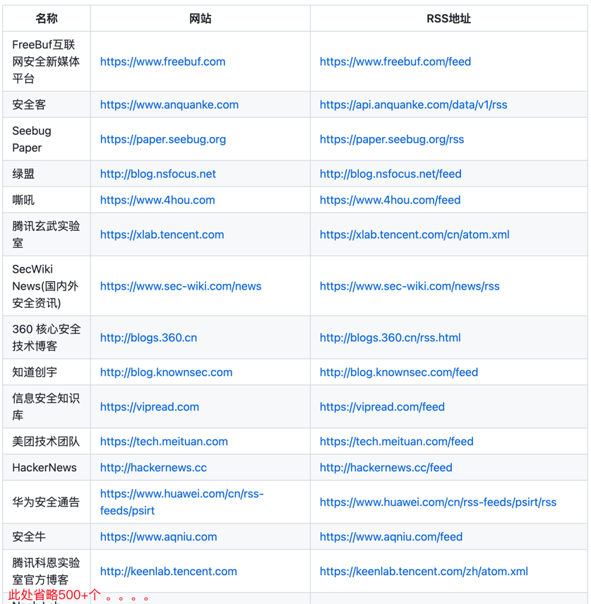

## 简介

:rage:平常大家看各类安全文章需要寻找各种安全公众号、论坛、博客，不能时时关注到最新发布的文章、业界最新咨讯。

:smile:该程序通过订阅各大安全公众号、论坛、博客，当他们有新发布的新发布的文章、业界最新咨讯将推动到企业微信的群上，让我们第一时间了解，学习～

---

:bookmark_tabs:RSS订阅源

本程序用的订阅源来自：Chinese-Security-RSS，一共`500+`安全相关订阅源

---

:warning: 使用

1、企业微信新建一个群，拉俩个人即可新建一个群，新建一个机器人

新建成功后，复制WebHook，替换conf/conf.py里的xxx即可

由于我个人是新建5个群（安全文章、漏洞复现、漏洞预警、免杀、实战攻防），方便浏览对应的文章。如果不想新建5个群的，只需要将一个机器的WebHook替换所有的XXXX即可，否则就单独替换

2、pip安装python库 `python3 -m pip install -r requirement.txt`

3、vps上运行程序 `python3 main.py`

---

:vertical_traffic_light: 后续计划

1、将对热门组件的补丁官网进行监控，当出现新的补丁时，第一时间发到企业微信群中

